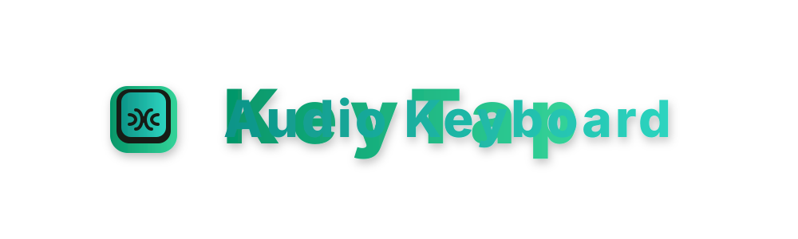

# KeyTap - The Chaos Sound Keyboard 🎹🔊

<p align="center">
  
</p>

A premium, system-wide keypress audio feedback utility featuring zero-latency polyphonic playback and a gorgeous, interactive 30 FPS vector graphics dashboard widget.

Created by **Jojo & Antigravity Coding Assistant (DeepMind)**.

---

## 🚀 Download & Quick Start (For General Users)

Getting started is extremely simple and self-contained!

### **🖥️ Windows Users:**
* **[👉 Click Here to Download KeyTap for Windows (KeyTap_Download.zip) 👈](https://github.com/SEEHIGHxb/KeyTap-audio-keyboard/raw/main/KeyTap_Download.zip)**
* **Instructions:** Extract the ZIP, double-click **`KeyTap.exe`**, and start typing! *(No Python setup required!)*

### **🍎 macOS Users:**
* **[👉 Click Here to Download KeyTap for macOS (KeyTap_macOS_Download.zip) 👈](https://github.com/SEEHIGHxb/KeyTap-audio-keyboard/raw/main/KeyTap_macOS_Download.zip)**
* **Instructions:**
  1. Extract the ZIP folder.
  2. **Bypass the macOS Gatekeeper block** (required for unsigned open-source scripts). Since macOS blocks it on first download, choose **one** of these simple ways to approve it:
     * **Method A (Easiest - Finder):** **Right-click** (or hold `Control` and click) `KeyTap_macOS.command` in Finder, and select **Open** from the menu. When the warning pops up, click the **Open** button to permanently allow it to run.
     * **Method B (Terminal):** Open the **Terminal** app, paste the following command (with a space at the end):
       ```bash
       xattr -d com.apple.quarantine 
       ```
       Drag the `KeyTap_macOS.command` file from your Finder window into Terminal to automatically paste its path, and press **Enter**.
  3. Double-click the **`KeyTap_macOS.command`** loader script in Finder to run it! This opens Terminal, installs any missing libraries (`customtkinter`, `pygame`, `pynput`) automatically, and launches the KeyTap GUI!
  4. *Permissions Fix:* If Finder says the script cannot be run because you don't have permissions, open Terminal in the folder and run:
     ```bash
     chmod +x KeyTap_macOS.command
     ```
  5. 🔒 **macOS Privacy Access Requirement:** Because KeyTap intercepts keystrokes system-wide (even when minimized), macOS requires you to grant Input Monitoring access. Go to: **System Settings ➡️ Privacy & Security ➡️ Input Monitoring** and make sure **Terminal** is enabled!

---

## ✨ Features

* **Sleek Horizontal Header:** Includes a side-by-side **ON/OFF Master Toggle Switch** and an active glowing status LED pill that pulses at runtime (Cyan for ACTIVE, Muted Slate for MUTED). When sound is OFF, the hook runs silently in the background without affecting performance or typing.
* **3-Column Centered Control Panel:** 
  * **Select Sound Pack:** Dropdown to hot-swap acoustics in real-time + a bold **"Scan Sound"** folder rescan button.
  * **Volume Adjustment:** Central horizontal slider and numerical readout (e.g., `80%`) to fine-tune sound levels.
  * **Change Theme:** ComboBox with 6 customized visual profiles.
* **Interactive 30 FPS Vector Art Canvas:** A gorgeous graphics canvas at the bottom of the widget that animates at 30 FPS, adapting its color scheme and rendering shapes to fit each theme dynamically:
  * 🐾 **Zoo Theme:** Undulating green vector hills and falling leaves (`🍃`) swaying in the wind.
  * 💖 **Love Theme:** Floating pixel hearts (`❤️`) drifting upward alongside a glowing love-pulse wave.
  * ☕ **Lo-Fi Cafe Theme:** Steaming vertical tea/coffee cups swaying over diagonal blind slits.
  * 👾 **8-Bit Theme:** Stepping square stars and a retro step-quantized arcade wave.
  * 🏖️ **Beach Theme:** Layers of bright teal ocean waves undulating in phase offsets under a golden sun.
  * ⚪ **Plain Theme:** A minimalist, hyper-clean vector oscilloscope line oscillating in Slate Blue.
* **Keystroke Ripple Explosions:** Typing any key system-wide spikes the wave amplitude and splashes expanding concentric vector ripples across the canvas in real-time!
* **State Caching Memory:** Swapping themes automatically saves your visual selections to `config.json` next to your script, persistently booting back into your last-selected theme on next launch.

---

## 🎵 How to Add Your Own Custom Sound Packs!

Want to use anime sound bites, meme clips, or custom typing clicks? It's incredibly easy!

1. Open the **`sound_packs/`** directory located right next to `KeyTap.exe`.
2. Create a new folder named after your pack (e.g., `sound_packs/My_Meme_Sounds/`).
3. Drop your favourite `.wav` audio files directly inside that folder.
4. Launch KeyTap, select your new pack from the **Select Sound Pack** dropdown, and start typing! 
   *(Click "Scan Sound" to refresh the list if you added the files while KeyTap was open)*

> [!TIP]
> **Context-Aware Acoustic Mapping:**
> If your sound pack contains files with names containing `space`, `enter`, or `backspace` (case-insensitive), KeyTap will automatically bind them to those keys! Standard alphanumeric typing will dynamically cycle through all other audio clips in the folder for a satisfying, melodic soundscape.

---

## 💻 Developer Guide & Custom Execution

If you prefer to run KeyTap from source code or compile your own binaries:

### 1. Prerequisites
Ensure you have Python 3.10+ installed. Install the external dependencies using:
```bash
pip install customtkinter pygame pynput
```

### 2. Run from Source
Execute the main script:
```bash
python audio_keyboard.py
```

### 3. Compile Your Own Executable
Create your own single-file, console-free Windows executable using PyInstaller:
```bash
pyinstaller --noconsole --onefile --name "KeyTap" audio_keyboard.py
```
This will compile a fresh `KeyTap.exe` inside the `dist/` directory.

---

## 🔒 Performance & System Compatibility
* **Zero Typing Latency:** Runs global keyboard interceptor hooks on an independent background daemon thread. Your input speeds are 100% unaffected.
* **Low Memory Footprint:** Pygame mixer pre-loads audio assets straight to RAM, allowing overlapping channels to play polyphonically without stuttering.
* **Resource Release:** Closing the widget GUI automatically terminates all hook threads and closes the pygame audio mixer cleanly.
